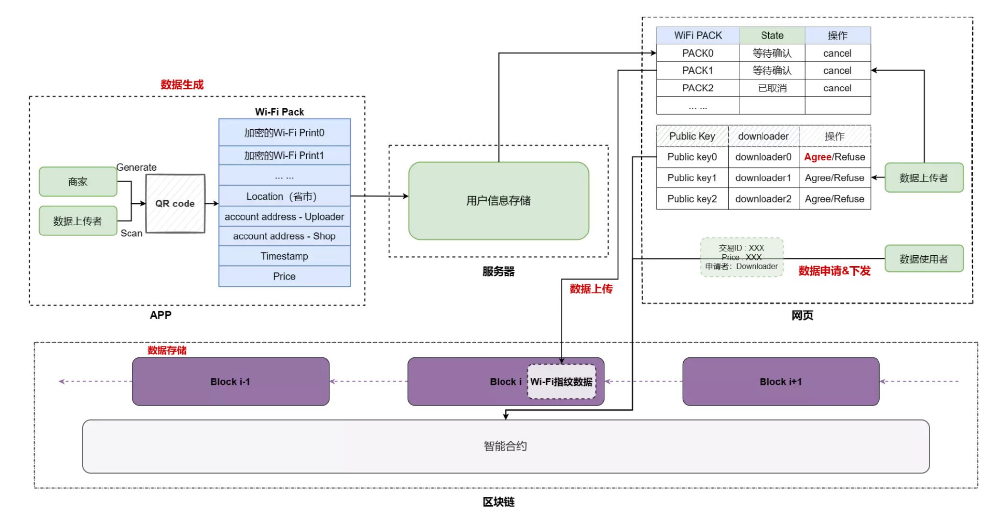
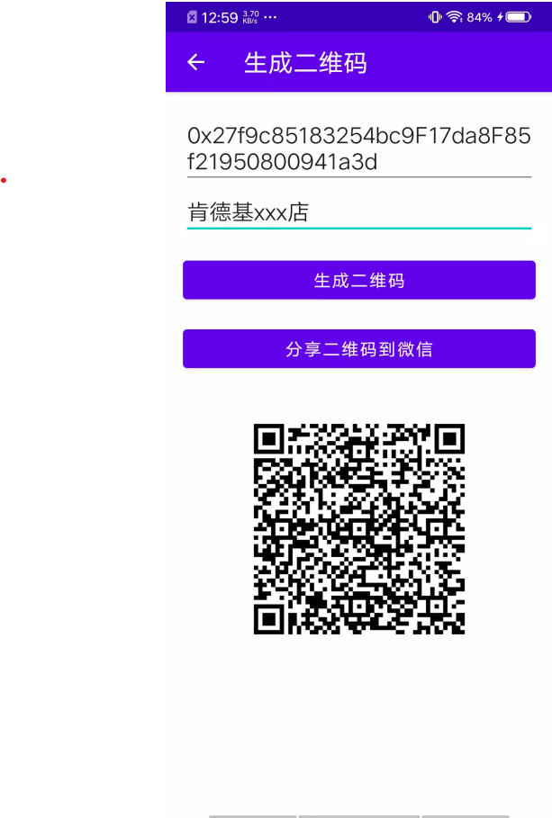
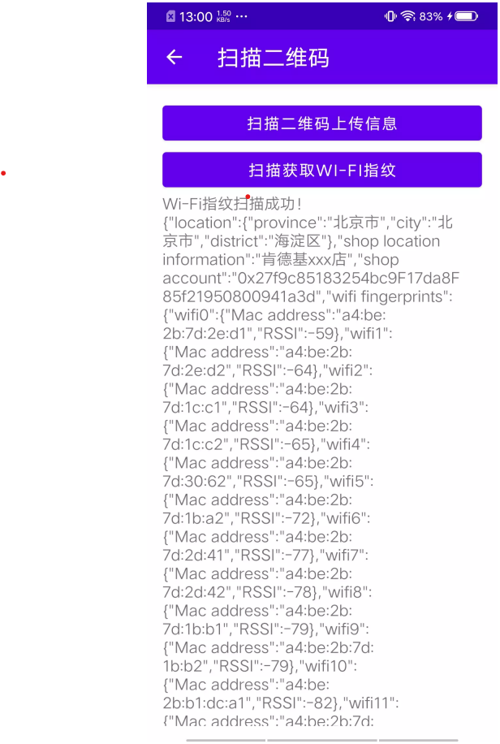

# Java大作业报告

## 小组成员：胡博文

## 整体系统介绍

### 概述

本系统是一个基于区块链的室内位置数据共享系统，利用区块链的去中心化等特点实现系统中位置数据信息的透明性和不可篡改性，以此为基础搭建WiFi指纹位置信息的共享平台。

### 系统主体

本系统主要包括五个主体，分别为数据上传者、商家、数据使用者（Wi-Fi指纹数据申请者）、智能合约、与矿工。其中，数据上传者与商家是本系统的数据贡献者，通过商家提供二维码，数据上传者扫描二维码的操作，可以实现将二维码中包含的商家地理位置信息以及用户的Wi-Fi指纹信息的打包上传；数据使用者可通过申请并缴纳一定保证金以获取一段时间 内的Wi-Fi指纹信息；智能合约在上述流程中发挥监督与执行等作用，包括接收Wi-Fi指纹信 息，判断信息有效性，激励分发等功能；矿工负责维护区块链并将新的Wi-Fi指纹信息上链，并从中获得一定代币奖励。

### 系统运行流程

## 大作业具体介绍

本系统Java部分主要实现在Android前端应用数据收集部分和服务器端的用户信息存储部分与位置数据转发部分。

### Android应用实现

#### 功能描述

该客户端的主要功能是用于商家生成二维码与用户扫描商家生成的二维码并上传所收集的WiFi指纹数据。因此我在MainActivity基础上实现了两个子Activity来分开实现以上两个功能。

#### MainActivity

该Activity主要包含两块内容：用户登录与最后上传数据。

##### 用户登录

首先我定义了一个AlertDialog对话框用于用户利用钱包账户名与私钥进行登录。同时为了用户私钥隐私性考虑，我利用Encrypter类以用户私钥为key对用户账户名进行加密，并将加密后的信息存储在服务器中。

##### 数据上传

在用户通过扫描二维码并获取到自己的位置信息后，可以为自己收集到的数据定价并将其上传至服务器中。在上传前，会调用Encrypter以用户提供的私钥为key对上传的数据进行加密。

#### GenerateQRCodeActivity

该Activity主要功能为商家生成商店信息的二维码。首先商家填写商店的具体位置信息与钱包的账户地址（用于获取收益），之后通过LocationManager类与Geocoder类获取商店所在地的省、市、区县。将这些信息组织成一个JSON类并利用QRCodeWriter类生成二维码，并可以直接将生成的二维码分享到微信。

##### 运行界面

#### ScanQRCodeActivity

该Activity主要功能为用户收集位置信息。首先用户会调用MyWifiManager类获取手机中的wifi信息缓存，并且将所收集的信息显示在图中信息框内。之后用户并扫描商家提供的二维码，将这些信息打包成一个JSON类返回个MainActivity以待在MainActivity中上传。

##### 运行界面

#### 工具类实现

为实现上述Activity类的相关功能，我建立了若干个工具类

##### Server类

该类用于与服务端进行通信，有两个函数log与upload分别用于用户登录与用户上传数据，每一次上传时启动一个线程用于与服务端通信。

##### Encrypter类

该类用于对用户收集的数据和对验证用户登录的信息进行加密。每一次加密，需要一个用于加密的密钥与被加密的数据。首先我会对加密的密钥用SHA-256方式进行哈希，之后再将哈希后的密钥截取前32位后用AES算法加密WiFi指纹数据返回。

##### MyWifiManager类

在该类中，我利用WifiManger类获取手机扫描二维码时刻的wifi缓存（或重新进行一次wifi扫描）之后返回有ScanResult结果足称的列表.

### ServerGet程序实现

#### 功能描述

该程序运行在服务端，为Android应用的上传数据和用户登录服务。

#### 具体实现

我在该程序中实现了两个类，LogHandler类和RequestHandler类都继承于Handler接口，之后在主程序中利用反射机制处理不同的请求类型，并在每个类的处理数据时启动一个线程，使得程序可以为多个客户端服务。

#### LogHandler类

在该类中，我在服务器存储数据的路径下查找是否有该账户地址所对应的目录。若有目录，则比对securityKey.txt中存储的用私钥加密的账户地址的信息是否相同，否则新建一个目录并将用私钥加密的账户地址存储在securityKey.txt文件下。

#### RequestHandler类

在该类中，我将利用ObjectMapper类将传入的字符串类型的数据转化成一个Json文件并给定一个随机文件名，将其写入上传者账户对应目录中，等待上传者在前端应用中将其上传到区块链与智能合约。

### ServerPost程序实现

#### 功能描述

该程序运行在服务端，是一个WebSocket程序，为前端NextApp返回用户加密后的数据。

#### 具体实现

我实现了一个MyWebSocketServer类继承于WebSocketServer类，在前端应用向服务器请求数据时，返回对应的数据，以便前端应用调用钱包插件将返回的数据上传至智能合约以及区块链。

## 程序亮点

- 在Android应用中集成了LocalManager，QRScanner等第三方库完整实现获取地理位置、扫描二维码等功能。
- 在Android应用中，实现微信分享二维码的功能。
- 在进行网络通信时使用多线程通信与反射机制实现多态。
- 该上传系统实现了从Android端收集数据并上传至区块链和智能合约的功能。在上传的过程中，会将数据和上传者的私钥进行加密，在确保平台透明性的同时保护了用户的隐私以及数据的安全的。
